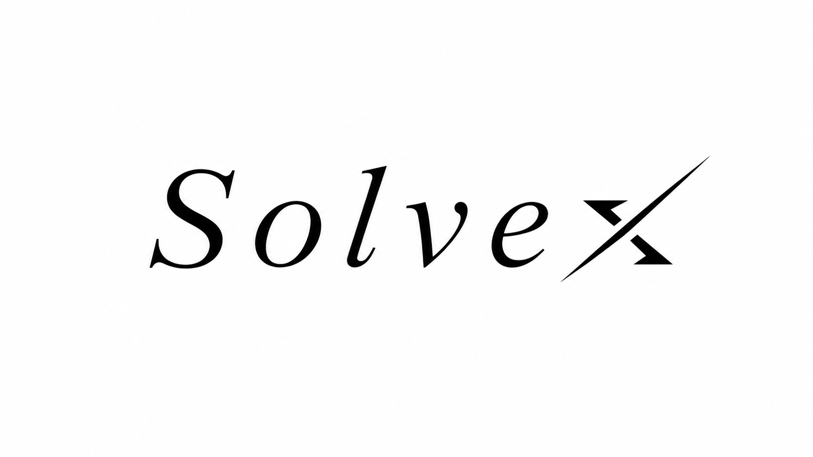

<div align="center">



# SolveX

### An AI-native workflow for mathematical modeling competitions

From problem statement to validated model, publication-ready figures, and a complete LaTeX paper.

[](https://www.python.org/) [](https://fastapi.tiangolo.com/) [](LICENSE)

</div>

## Overview

SolveX is a multi-agent mathematical modeling system designed for competition-style problems. It coordinates specialized agents through an iterative modeling and programming loop, turning an unstructured problem into a reproducible, reviewable deliverable.

```text
Problem → Modeling ↔ Programming → Visualization → LaTeX Paper → Output
```

## What SolveX delivers

- **Modeling** — decomposes the problem, researches relevant methods, and proposes an actionable solution plan.
- **Programming** — implements the model in Python, runs experiments, and checks results.
- **Visualization** — produces publication-quality figures with a traceable figure catalog.
- **Writing** — assembles a complete LaTeX paper from the verified work.
- **Iteration** — keeps modeling and implementation in a feedback loop instead of treating them as one-shot steps.

Additional capabilities include ArXiv and web research, long-session memory compaction, CSV/XLSX/ZIP data inputs, and a FastAPI interface with streaming progress and ZIP export.

## Quick start

### 1. Install

```bash
python -m venv .venv
source .venv/bin/activate        # Windows: .venv\Scripts\activate
pip install -r requirements.txt
```

### 2. Configure your model provider

```bash
cp config/config.example.toml config/config.toml
```

Edit `config/config.toml` with your provider, model, and credentials.

### 3. Run a problem

CLI mode:

```bash
python run_flow.py --problem tests/competition/2025_C/problem.txt --data tests/competition/2025_C/data/
```

Web mode:

```bash
python api.py
```

Then open <http://localhost:8000>.

## Local excellent-paper knowledge base

SolveX can keep complete, approved LaTeX competition papers in a local Qdrant
knowledge base. The data path is deliberately separate from a competition run:

```text
LaTeX + paper.yaml → safe import and section-aware chunks → Qdrant
  (multilingual-e5-large dense + BM25 sparse, RRF) → paper_search
  → ModelingAgent / WritingAgent
```

Start the single-node service before importing papers:

```bash
docker compose -f docker-compose.knowledge.yml up -d
```

It exposes only `127.0.0.1:6333` and keeps data in the named
`solvex_qdrant_storage` volume; it is not a public Qdrant deployment. Check
its health at <http://127.0.0.1:6333/healthz>.

Enable the optional configuration after Qdrant is healthy:

```toml
[knowledge]
enabled = true
qdrant_url = "http://127.0.0.1:6333"
collection_name = "solvex_papers"
dense_model = "intfloat/multilingual-e5-large"
sparse_model = "Qdrant/bm25"
default_top_k = 6
```

Every source directory (or ZIP with the same root layout) needs a
`paper.yaml` next to its declared main `.tex` file:

```yaml
schema_version: 1
paper_id: mcm-2025-c-outstanding-01
title: Example Title
competition: MCM
year: 2025
problem: C
award: Outstanding Winner
language: en
methods: [optimization, regression]
main_tex: main.tex
```

The importer reads only that main file and safe `\input`/`\include` targets;
it does not execute TeX, store images, bibliography files, or build products.
Use the management CLI to import and inspect the corpus:

```bash
python knowledge.py ingest papers/mcm-2025-c-outstanding-01
python knowledge.py ingest papers/ --recursive
python knowledge.py list
python knowledge.py search "robust network optimization" --competition MCM --year 2025 --methods optimization
python knowledge.py delete mcm-2025-c-outstanding-01 --yes
python knowledge.py reindex papers/ --yes
```

`reindex` loads every source into a new physical collection, checks it, and
only then atomically moves the stable alias. A bad source or an empty corpus
leaves the current index active. Import, delete, and rebuild commands return a
non-zero status on failure.

On first use FastEmbed downloads the multilingual E5 model (about 2.24 GB) to
the stable local cache `~/.cache/solvex/fastembed` (or the path set in
`FASTEMBED_CACHE_PATH`); plan CPU/RAM accordingly (the default deployment
assumes at least 16 GB RAM). For fully offline hosts, prepare that cache in
advance.
If Qdrant, the model, or its index schema is unavailable during a SolveX run,
`paper_search` records a warning and the agents continue with their normal
ArXiv/Tavily workflow.

Imported papers are internal examples, not sources for automatic citation or
copying. The writing agent may learn structure and LaTeX patterns from them,
but all numerical claims must come from the current run; do not copy passages,
and reviewed papers are not automatically added to the final bibliography.

## Architecture

```text
app/
├── agent/       # Modeling, programming, visualization, and writing agents
├── flow/        # SolveX workflow orchestration
├── prompt/      # Agent system prompts
├── service/     # Memory and session services
├── tool/        # Execution, editing, and research tools
├── llm.py       # Provider-agnostic LLM abstraction
└── schema.py    # Shared data models
config/          # LLM and MCP configuration
static/          # Web interface assets
api.py           # FastAPI entry point
run_flow.py      # CLI entry point
```

## Output layout

Each run is organized for inspection and reuse:

```text
workspace/
├── 01_modeling/     # Plans and final modeling decisions
├── 02_programming/  # Source code, predictions, and results
├── 03_figures/      # Figures and figure catalog
└── 04_paper/        # Complete LaTeX manuscript
```

## Design principles

1. **Reproducibility first** — preserve plans, code, data products, and figures together.
2. **Verification before narration** — written conclusions should follow executable results.
3. **Modular agents** — each stage can be inspected, improved, or replaced independently.
4. **Human reviewable** — intermediate artifacts remain available for debugging and critique.

## Contributing

Issues and pull requests are welcome. When contributing, please include a concise description of the change and, where relevant, a reproducible example or test.

## License

SolveX is released under the [MIT License](LICENSE). The project is inspired by and builds on concepts from [OpenManus](https://github.com/FoundationAgents/OpenManus).
